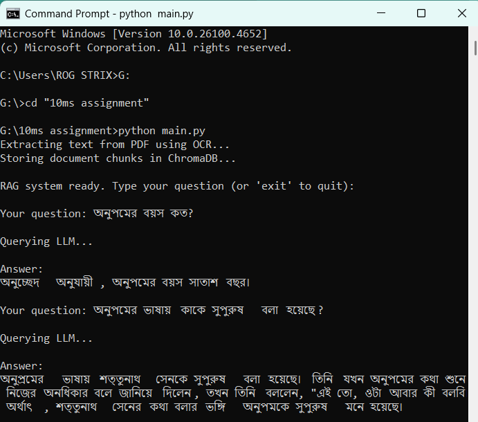

# Bengali PDF RAG System

This project implements a Retrieval-Augmented Generation (RAG) system for Bengali PDFs using OCR, vector search, and a local LLM (Ollama). It extracts text from a PDF using Tesseract OCR, stores embeddings in ChromaDB, and answers user queries using an LLM with context retrieval.

## Features
- OCR extraction from Bengali PDFs (using Tesseract)
- Embedding and vector search with ChromaDB and SentenceTransformers
- Local LLM querying via Ollama
- Simple CLI for interactive Q&A

## Requirements
- Python 3.8+
- [Tesseract OCR](https://github.com/tesseract-ocr/tesseract) (must be installed and in PATH)
- [Ollama](https://ollama.com/)(pull the gemma3:latest model for running it locally)
- pip packages (see below)

## Python Dependencies
Install required Python packages:
```bash
pip install pdfplumber pytesseract pillow chromadb sentence-transformers ollama
```

## Tesseract Setup
- Download and install Tesseract from [here](https://github.com/tesseract-ocr/tesseract).
- Make sure Bengali language data is installed. On Windows, you may need to download `ben.traineddata` and place it in the `tessdata` folder.
- Ensure `tesseract` is in your system PATH.

## Ollama Setup
- Download and install Ollama from [https://ollama.com/download](https://ollama.com/download).
- Start the Ollama server (usually starts automatically).
- Pull the required model (default: `gemma3:latest`). For example:
  ```bash
  ollama pull gemma3:latest
  ```

## Usage
1. Place your Bengali PDF in the project directory (default: `tenms.pdf`).
2. Run the main script:
   ```bash
   python main.py
   ```
3. Follow the CLI prompts to ask questions about the PDF. Type `exit` to quit.

## File Overview
- `main.py` - Entry point, runs the RAG pipeline and CLI.
- `ocr_module.py` - Extracts text from PDF using Tesseract OCR.
- `vector_module.py` - Handles embedding, vector storage, and retrieval with ChromaDB.
- `llm_module.py` - Sends queries to the local LLM via Ollama.
- `tenms.pdf` - Example PDF (replace with your own as needed).

## Notes
- Make sure both Tesseract and Ollama are running and accessible from your system.

## Demo Input-Output
 


## QnA

- What method or library did you use to extract the text, and why? Did you face any formatting challenges with the PDF content?

Ans: First I tried to extract the text using pymupdf. But upon doing so I noticed that the bengali characters were broken. So instead of directly extracting the text with a pdf reader library, I used OCR (Optical Character Recognition). I have used the Pytesseract module for OCR. 

- 